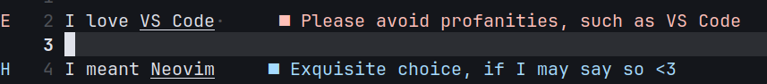
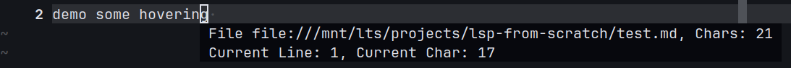
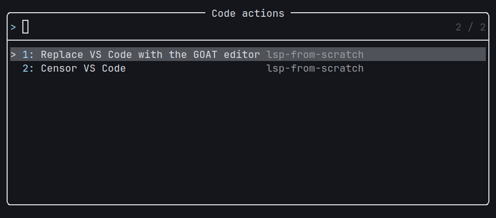
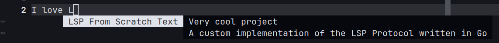

# LSP From Scratch

## Overview

"LSP From Scratch" is an educational project with the goal of gaining a comprehensive understanding of the Language Server Protocol (LSP) by implementing it from the ground up in Go. 

## What is a Language Server Protocol (LSP)?

The [Language Server Protocol](https://microsoft.github.io/language-server-protocol/) (LSP) is a standardized protocol used to provide language-specific features like auto-completion, go-to-definition, and linting in code editors. It was developed by Microsoft to decouple the language-specific logic from the editor, allowing for a more modular and reusable approach to implementing language features.

### Key Benefits of LSP

- **Editor Agnostic**: LSP allows language features to be implemented once and used across multiple editors, such as VS Code, Sublime Text, and Neovim.
- **Consistency**: By using a standardized protocol, LSP ensures consistent behavior and features across different development environments.
- **Extensibility**: LSP makes it easier to add support for new languages and features without modifying the editor itself.

### How LSP Works

LSP operates on a client-server model where the client is the code editor and the server is the language server. The client sends requests to the server, such as "find the definition of this symbol" or "provide auto-completion suggestions," and the server responds with the appropriate information. The communication can be handled over a few different protocols, however, for the sake of this project I've used the recommended approach of [JSON RPC](https://www.jsonrpc.org/specification).

### Common LSP Tasks

- **Text Document Management**: Handling the opening, updating, and closing of text documents.
- **Diagnostics**: Providing error and warning messages based on the analysis of the code.
- **Hover**: Displaying information when hovering over symbols.
- **Go-to-Definition**: Navigating to the definition of symbols.
- **Code Actions**: Offering quick fixes and refactoring options.
- **Completion**: Providing code completion suggestions.

By implementing an LSP server, developers can create powerful language tools that enhance the coding experience across multiple editors.

## Examples
> Note that all these features provide predetermined information, and no actual analysis is done by the lsp as the goal is to learn the protocol.

### Diagnostics: Analyze text documents and provide diagnostics.


### Hover: Provide hover information for text documents.


### Code Actions: Offer code actions based on diagnostics.



### Completion: Provide code completions.


## Project Structure

The project is organized into several packages:

- **analyzer**: Contains the core logic for state management and providing results for LSP features.
- **lsp**: Defines the LSP types and handles LSP-specific logic.
- **rpc**: Manages the communication between the language server and the client.
- **main**: The entry point of the application, determines what actions to perform depending on incoming requests.

## Getting Started

### Prerequisites

- Go 1.23.0 or later

### Installation

1. Clone the repository:
    ```sh
    git clone https://github.com/sh4r10/lsp-from-scratch.git
    cd lsp-from-scratch
    ```

2. Build the project:
    ```
    go build main.go
    ```

### Running the Server

#### Neovim
Add the following to your `init.lua`
```
local my_client = vim.lsp.start_client {
  name = 'lsp-from-scratch',
  cmd = { '/mnt/lts/projects/lsp-from-scratch/main' },
}
-- if the client is not found
if not my_client then
  vim.notify 'Hey man, you fucked up'
  return
end

vim.lsp.set_log_level 'debug'

-- attach on markdown files
vim.api.nvim_create_autocmd('FileType', {
  pattern = 'markdown',
  callback = function()
    vim.notify 'Client attaching to buffer'
    vim.lsp.buf_attach_client(0, my_client)
  end,
})
```

## Educational Aspect

This project is designed to be a learning tool for me in understanding the Language Server Protocol. By building a language server from scratch, I gained insights into:

- The structure and communication patterns of LSP.
- How to implement various LSP features.
- Some go

## Credits

This project is inspired by and credits [educationallsp](https://github.com/tjdevries/educationalsp) for providing the foundational knowledge and resources necessary to build a language server from scratch. As well as the supplementary video from the same creator [@tjdevries](https://github.com/tjdevries) [https://www.youtube.com/watch?v=YsdlcQoHqPY](https://www.youtube.com/watch?v=YsdlcQoHqPY).
